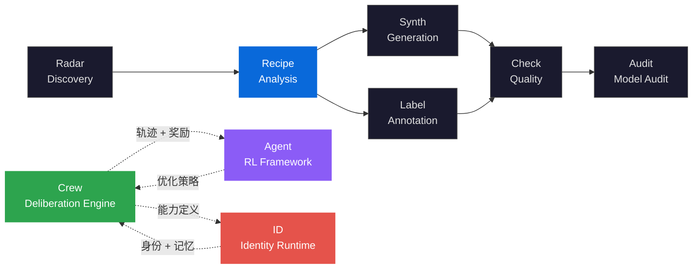

<div align="center">

<h1>DataRecipe</h1>

<h3>Automated Dataset Reverse Engineering<br/>and Reproduction Cost Estimation</h3>

<p><strong>数据集逆向工程框架 — Schema 推断 · 成本建模 · LLM 增强分析 · 23+ 生产文档</strong><br/>
<em>Reverse-engineering framework for AI datasets — extract annotation specs, cost models, and reproducibility plans from samples or requirement documents</em></p>

[](https://pypi.org/project/knowlyr-datarecipe/)
[](https://pypi.org/project/knowlyr-datarecipe/)
[](https://www.python.org/downloads/)
[](LICENSE)
<br/>
[](https://github.com/liuxiaotong/data-recipe/actions/workflows/ci.yml)
[](#development)
[](#development)
[](#mcp-server)
[](#output-structure)

[Abstract](#abstract) · [Problem Statement](#problem-statement) · [Formal Framework](#formal-framework) · [Architecture](#architecture) · [Key Innovations](#key-innovations) · [Quick Start](#quick-start) · [Output Structure](#output-structure) · [MCP Server](#mcp-server) · [Ecosystem](#ecosystem) · [References](#references)

</div>

---

## Abstract

复刻一个 AI 数据集需要回答三个问题：**数据长什么样** (Schema)、**要花多少钱** (Cost)、**怎么做** (Methodology)。现有方法依赖人工阅读论文和样本，逐个回答这三个问题——耗时、主观、不可复用。

DataRecipe 提出**自动化数据集逆向工程框架** (automated dataset reverse engineering)：从数据集样本或需求文档出发，通过**六阶段分析流水线** (6-stage analysis pipeline) 自动推断 Schema 结构、提取评分标准和 Prompt 模板、估算分阶段成本、分析人机分配比例，输出覆盖 6 类用户角色的 **23+ 生产级文档**。**LLM 增强层** (LLM Enhancement Layer) 一次调用生成 `EnhancedContext`，将模板化文档升级为具备领域洞察的专业分析。

> **DataRecipe** implements an automated dataset reverse engineering framework. The system ingests HuggingFace datasets or requirement documents (PDF/Word/Image), runs a 6-stage analysis pipeline (schema inference, rubric extraction, prompt extraction, cost modeling, human-machine split, benchmark comparison), and generates 23+ production documents for 6 stakeholder roles (executive, PM, annotators, engineers, finance, AI agents). An LLM Enhancement Layer produces `EnhancedContext` in a single call, upgrading template outputs to domain-specific professional analyses. 3399 tests, 97% coverage.

---

## Problem Statement

数据集复刻领域面临三个结构性问题：

| 根本性问题 | 形式化定义 | 现有方法局限 | DataRecipe 的方法 |
|:---|:---|:---|:---|
| **逆向不可自动化**<br/>Manual Reverse Engineering | 从样本推断构建规范需要人工阅读论文、分析数据结构、编写规范 | 全人工流程，耗时数天，跨数据集不可复用 | 六阶段自动分析流水线：Schema 推断 → 评分标准提取 → Prompt 模板提取 → 成本建模 → 人机分配 → 行业基准 |
| **成本不可预估**<br/>Cost Opacity | 复刻成本隐含在标注方案、人员配置、质检策略中 $\implies$ 总成本 = $\sum_i f(t_i, c_i, q_i)$ | 依赖"经验估算"，无标准化成本模型 | Token 级精确分析 + 分阶段成本明细 + 人机分配比例 |
| **文档碎片化**<br/>Documentation Fragmentation | 决策层、项目经理、标注团队需要不同视角的文档 | 手工编写不同文档，格式和内容不统一 | 23+ 文档统一生成，覆盖 6 类用户角色，人类可读 + 机器可解析双格式 |

> DataRecipe 不是数据集浏览器。它是**数据集的逆向工程工具**——回答"这个数据集是怎么做的、花了多少钱、我怎么复刻"，输出可以直接用于生产的完整方案。

---

## Formal Framework

### Dataset Schema Inference

数据集 Schema 推断为四元组 $\mathcal{S} = \langle F, T, C, D \rangle$：

| 符号 | 定义 | 说明 |
|:---|:---|:---|
| $F = \{f_1, \ldots, f_n\}$ | 字段集合 | 自动从样本推断 |
| $T: F \to \{\text{text}, \text{int}, \text{float}, \text{list}, \text{enum}\}$ | 类型映射 | 统计推断 |
| $C: F \to \text{Constraints}$ | 约束映射 | range / enum / length |
| $D: F \to \text{Distribution}$ | 分布描述 | 长度 / 频率 / 基数 |

### Cost Model

复刻成本分解为分阶段模型：

$$\text{Cost}(D) = \sum_{p \in \text{phases}} \left( c_h(p) \cdot |F_h(p)| + c_m(p) \cdot |F_m(p)| \right)$$

其中 $c_h, c_m$ 分别为人工和机器单位成本，$|F_h|, |F_m|$ 为人工和机器处理的字段量。人机分配比例 $\rho = \frac{|F_h|}{|F_h| + |F_m|}$ 由字段复杂度决定。

### Complexity Scoring

数据集复刻难度由四个维度综合决定：

$$\text{Difficulty}(D) = w_d \cdot d_{\text{domain}} + w_s \cdot d_{\text{schema}} + w_z \cdot d_{\text{size}} + w_q \cdot d_{\text{quality}}$$

其中 $d_{\text{domain}}$ 为领域专业度，$d_{\text{schema}}$ 为 Schema 复杂度（字段数 × 约束数），$d_{\text{size}}$ 为规模系数，$d_{\text{quality}}$ 为质量要求等级。

### LLM Enhancement Layer

在分析和文档生成之间插入增强层——一次 LLM 调用生成 `EnhancedContext`（14 个增强字段），所有文档生成器消费该对象：

$$\text{Docs} = \{g_i(\text{Analysis}, \text{EnhancedContext})\}_{i=1}^{23}$$

三种运行模式：`auto`（自动检测环境）、`interactive`（宿主 LLM 处理）、`api`（独立调用 Anthropic / OpenAI）。

---

## Architecture


### Six-Stage Analysis Pipeline

| 阶段 | 模块 | 产出 |
|:---|:---|:---|
| 1. Schema Inference | `deep_analyzer.py` | 字段结构、类型、约束、分布 |
| 2. Rubric Extraction | `rubrics_analyzer.py` | 评分标准、标注维度 |
| 3. Prompt Extraction | `prompt_extractor.py` | Prompt 模板、变量结构 |
| 4. Cost Modeling | `phased_model.py` · `token_analyzer.py` | 分阶段成本、Token 分析 |
| 5. Human-Machine Split | `human_machine_split.py` | 人工/机器分配比例 |
| 6. Benchmark Comparison | `industry_benchmark.py` | 行业基准对比 |

### Stakeholder-Oriented Output

| 角色 | 关注目录 | 获得什么 |
|:---|:---|:---|
| 决策层 | `01_决策参考/` | 价值评分、ROI 分析、竞争定位 |
| 项目经理 | `02_项目管理/` | 里程碑、验收标准、风险管理 |
| 标注团队 | `03_标注规范/` | 标注指南、培训手册、质检清单 |
| 技术团队 | `04_复刻指南/` | 生产 SOP、数据结构、复刻策略 |
| 财务 | `05_成本分析/` | 分阶段成本、人机分配 |
| AI Agent | `08_AI_Agent/` | 结构化上下文、可执行流水线 |

---

## Key Innovations

### 1. LLM Enhancement Layer

核心创新：在分析和生成之间插入 LLM 增强层——一次调用生成 `EnhancedContext`（14 个字段），将模板化文档升级为专业分析。

| 文档 | 无 LLM | 有 LLM |
|:---|:---|:---|
| EXECUTIVE_SUMMARY | 通用占位符 | 具体 ROI 数字、竞争定位 |
| ANNOTATION_SPEC | 模板化规范 | 领域标注指导、常见错误 |
| REPRODUCTION_GUIDE | 几乎空白 | 完整复刻策略、风险矩阵 |

三种运行模式：`auto`（自动检测）、`interactive`（宿主 LLM）、`api`（独立调用）。

### 2. Six-Stage Automated Analysis

从样本到完整方案的六阶段自动化流水线，无需人工干预。每个阶段的输出同时生成人类可读 (Markdown) 和机器可解析 (JSON/YAML) 格式。

### 3. Multi-Source Input

支持 HuggingFace 数据集直接分析和需求文档分析（PDF / Word / 图片 / 文本），两种路径共享相同的输出结构和文档生成器。

**智能难度验证**：当文档含难度要求时，自动提取验证配置并生成 `DIFFICULTY_VALIDATION.md`。

### 4. Token-Level Cost Analysis

基于 Token 精确分析的分阶段成本模型，包含人机分配比例、复杂度校准、行业基准对比：

```bash
knowlyr-datarecipe deep-analyze tencent/CL-bench --use-llm
```

### 5. Radar Integration

与 AI Dataset Radar 深度集成——从 Radar 报告批量分析新发现的数据集，生成综合报告：

```bash
knowlyr-datarecipe batch-from-radar radar_report.json
knowlyr-datarecipe integrate-report
```

### 6. Agent-Ready Output

`08_AI_Agent/` 目录包含结构化上下文 (`agent_context.json`)、工作流状态 (`workflow_state.json`)、推理链 (`reasoning_traces.json`) 和可执行流水线 (`pipeline.yaml`)——AI Agent 可以直接消费这些输出来执行后续任务。

---

## Quick Start

```bash
pip install knowlyr-datarecipe
```

<details>
<summary>可选依赖</summary>

```bash
pip install knowlyr-datarecipe[llm]      # LLM 分析 (Anthropic/OpenAI)
pip install knowlyr-datarecipe[pdf]      # PDF 解析
pip install knowlyr-datarecipe[mcp]      # MCP 服务器
pip install knowlyr-datarecipe[all]      # 全部
```

</details>

```bash
# 分析 HuggingFace 数据集（纯本地，无需 API key）
knowlyr-datarecipe deep-analyze tencent/CL-bench

# 启用 LLM 增强
knowlyr-datarecipe deep-analyze tencent/CL-bench --use-llm

# 分析需求文档
knowlyr-datarecipe analyze-spec requirements.pdf

# 交互模式（Claude Code 中使用，无需 API key）
knowlyr-datarecipe analyze-spec requirements.pdf --interactive
```

---

## Output Structure

<details>
<summary>完整目录结构（23+ 文件）</summary>

```
projects/{数据集名}/
├── README.md                        # 导航枢纽
├── recipe_summary.json              # 核心摘要 (Radar 兼容)
├── 01_决策参考/EXECUTIVE_SUMMARY.md
├── 02_项目管理/MILESTONE_PLAN.md · INDUSTRY_BENCHMARK.md
├── 03_标注规范/ANNOTATION_SPEC.md · TRAINING_GUIDE.md · QA_CHECKLIST.md
├── 04_复刻指南/REPRODUCTION_GUIDE.md · PRODUCTION_SOP.md · ANALYSIS_REPORT.md · DATA_SCHEMA.json
├── 05_成本分析/COST_BREAKDOWN.md
├── 06_原始数据/enhanced_context.json · *.json
├── 07_模板/data_template.json
├── 08_AI_Agent/agent_context.json · workflow_state.json · reasoning_traces.json · pipeline.yaml
├── 09_样例数据/samples.json · SAMPLE_GUIDE.md
├── 10_生产部署/recipe.yaml · annotation_guide.md · quality_rules.yaml · acceptance_criteria.yaml
└── 11_综合报告/weekly_report_*.md
```

</details>

---

## MCP Server

```json
{
  "mcpServers": {
    "knowlyr-datarecipe": {
      "command": "uv",
      "args": ["--directory", "/path/to/data-recipe", "run", "knowlyr-datarecipe-mcp"]
    }
  }
}
```

| Tool | Description |
|:---|:---|
| `analyze_huggingface_dataset` | 深度分析 HF 数据集 |
| `enhance_analysis_reports` | 应用 LLM 增强 |
| `parse_spec_document` | 解析需求文档 |
| `generate_spec_output` | 生成 23+ 项目文档 |
| `extract_rubrics` | 提取评分标准 |
| `extract_prompts` | 提取 Prompt 模板 |
| `compare_datasets` | 对比多个数据集 |
| `profile_dataset` | 数据集画像 + 成本估算 |
| `get_agent_context` | 获取 AI Agent 上下文 |
| `recipe_template` | 生成标注模板 |
| `recipe_diff` | 对比两个分析结果 |
| `get_extraction_prompt` | 获取 LLM 提取模板 |

---

## CLI Reference

<details>
<summary>完整命令列表</summary>

| 命令 | 功能 |
|:---|:---|
| `knowlyr-datarecipe deep-analyze <dataset>` | 深度分析 HF 数据集 |
| `knowlyr-datarecipe deep-analyze ... --use-llm` | 启用 LLM 增强 |
| `knowlyr-datarecipe deep-analyze ... --enhance-mode api` | 指定增强模式 |
| `knowlyr-datarecipe analyze-spec <file>` | 分析需求文档 |
| `knowlyr-datarecipe analyze-spec ... --interactive` | 交互模式 |
| `knowlyr-datarecipe analyze <dataset>` | 快速分析 |
| `knowlyr-datarecipe profile <dataset>` | 标注员画像 + 成本 |
| `knowlyr-datarecipe extract-rubrics <dataset>` | 提取评分标准 |
| `knowlyr-datarecipe deploy <dataset>` | 生成部署配置 |
| `knowlyr-datarecipe integrate-report` | Radar + Recipe 综合报告 |
| `knowlyr-datarecipe batch-from-radar <report>` | 从 Radar 批量分析 |

</details>

---

## Ecosystem

<details>
<summary>Architecture Diagram</summary>



</details>

| Layer | Project | Description | Repo |
|:---|:---|:---|:---|
| Discovery | **AI Dataset Radar** | 数据集竞争情报、趋势分析 | [GitHub](https://github.com/liuxiaotong/ai-dataset-radar) |
| Analysis | **DataRecipe** | 逆向工程 · Schema 推断 · 成本建模 · LLM 增强分析 | You are here |
| Production | **DataSynth** / **DataLabel** | LLM 批量合成 / 轻量标注 | [GitHub](https://github.com/liuxiaotong/data-synth) · [GitHub](https://github.com/liuxiaotong/data-label) |
| Quality | **DataCheck** | 规则验证、重复检测、分布分析 | [GitHub](https://github.com/liuxiaotong/data-check) |
| Audit | **ModelAudit** | 蒸馏检测、模型指纹 | [GitHub](https://github.com/liuxiaotong/model-audit) |
| Identity | **knowlyr-id** | 身份系统 + AI 员工运行时 | [GitHub](https://github.com/liuxiaotong/knowlyr-id) |
| Deliberation | **Crew** | 对抗式多智能体协商 · 持久记忆进化 · MCP 原生 | [GitHub](https://github.com/liuxiaotong/knowlyr-crew) |
| Agent Training | **knowlyr-agent** | Gymnasium 风格 RL 框架 · 过程奖励模型 · SFT/DPO/GRPO | [GitHub](https://github.com/liuxiaotong/knowlyr-agent) |

```bash
# 端到端工作流
knowlyr-datarecipe deep-analyze tencent/CL-bench --use-llm      # 分析
knowlyr-datalabel generate ./projects/tencent_CL-bench/          # 标注
knowlyr-datasynth generate ./projects/tencent_CL-bench/ -n 1000  # 合成
knowlyr-datacheck validate ./projects/tencent_CL-bench/          # 质检
```

---

## Development

```bash
git clone https://github.com/liuxiaotong/data-recipe.git
cd data-recipe
make install
make test    # 3399 test cases, 97% coverage
```

**CI**: GitHub Actions，Python 3.10–3.13。Tag push 自动发布 PyPI + GitHub Release。

详见 [CONTRIBUTING.md](CONTRIBUTING.md)。

---

## References

- **Dataset Documentation** — Gebru, T. et al., 2021. *Datasheets for Datasets.* Communications of the ACM — 数据集文档化的标准框架
- **Data-Centric AI** — Zha, D. et al., 2023. *Data-centric Artificial Intelligence: A Survey.* [arXiv:2303.10158](https://arxiv.org/abs/2303.10158) — 以数据为中心的 AI 方法论
- **Annotation Guidelines** — Pustejovsky, J. & Stubbs, A., 2012. *Natural Language Annotation for Machine Learning.* O'Reilly — 标注规范设计方法
- **Cost Estimation** — Boehm, B., 1981. *Software Engineering Economics.* Prentice Hall — 工程成本估算模型的范式来源
- **Reverse Engineering** — Chikofsky, E.J. & Cross, J.H., 1990. *Reverse Engineering and Design Recovery.* IEEE Software — 逆向工程方法论

---

## License

[MIT](LICENSE)

---

<div align="center">
<sub><a href="https://github.com/liuxiaotong">knowlyr</a> — automated dataset reverse engineering and reproduction cost estimation</sub>
</div>
