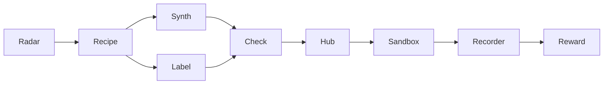

<div align="center">

# DataRecipe

**AI 数据集逆向工程框架**

[](https://pypi.org/project/knowlyr-datarecipe/)
[](https://www.python.org/downloads/)
[](LICENSE)
[](#mcp-server)

[快速开始](#快速开始) · [LLM 增强](#llm-增强层) · [需求文档分析](#需求文档分析) · [MCP Server](#mcp-server) · [Data Pipeline 生态](#data-pipeline-生态)

</div>

---

从数据集样本或需求文档中自动提取构建范式，生成 **23+ 生产级文档**，覆盖决策、项目管理、标注规范、成本分析全链路。

```
数据集 / 需求文档 → 逆向分析 → [LLM 增强层] → 23+ 结构化文档 (人类可读 + 机器可解析)
```

### 谁在用

| 角色 | 关注目录 | 获得什么 |
|------|---------|---------|
| 决策层 | `01_决策参考/` | 价值评分、ROI 分析、竞争定位 |
| 项目经理 | `02_项目管理/` | 里程碑、验收标准、风险管理 |
| 标注团队 | `03_标注规范/` | 标注指南、培训手册、质检清单 |
| 技术团队 | `04_复刻指南/` | 生产 SOP、数据结构、复刻策略 |
| 财务 | `05_成本分析/` | 分阶段成本、人机分配 |
| AI Agent | `08_AI_Agent/` | 结构化上下文、可执行流水线 |

## 安装

```bash
pip install knowlyr-datarecipe

# 可选依赖
pip install knowlyr-datarecipe[llm]      # LLM 分析 (Anthropic/OpenAI)
pip install knowlyr-datarecipe[pdf]      # PDF 解析
pip install knowlyr-datarecipe[mcp]      # MCP 服务器
pip install knowlyr-datarecipe[all]      # 全部
```

## 快速开始

### 分析 HuggingFace 数据集

```bash
# 基础分析 (纯本地，无需 API key)
knowlyr-datarecipe deep-analyze tencent/CL-bench

# 启用 LLM 增强 (在 Claude Code/App 中运行，自动利用宿主 LLM)
knowlyr-datarecipe deep-analyze tencent/CL-bench --use-llm

# 独立运行时用 API
knowlyr-datarecipe deep-analyze tencent/CL-bench --use-llm --enhance-mode api
```

### 分析需求文档

```bash
# API 模式 (需要 ANTHROPIC_API_KEY)
knowlyr-datarecipe analyze-spec requirements.pdf

# 交互模式 (在 Claude Code 中使用，无需 API key)
knowlyr-datarecipe analyze-spec requirements.pdf --interactive

# 从预计算 JSON 加载
knowlyr-datarecipe analyze-spec requirements.pdf --from-json analysis.json
```

<details>
<summary>输出示例 (deep-analyze)</summary>

```
============================================================
  DataRecipe 深度逆向分析
============================================================

数据集: tencent/CL-bench
✓ 加载完成: 300 样本
✓ 评分标准: 4120 条, 2412 种模式
✓ Prompt模板: 293 个
✓ 人机分配: 人工 84%, 机器 16%
✓ LLM 增强完成

输出目录: ./projects/tencent_CL-bench/
生成文件: 29 个
  📄 01_决策参考/EXECUTIVE_SUMMARY.md
  📋 02_项目管理/MILESTONE_PLAN.md
  📝 03_标注规范/ANNOTATION_SPEC.md
  ...
```

</details>

---

## LLM 增强层

核心创新：在分析和生成之间插入 **LLM 增强层**，一次调用生成富上下文对象 `EnhancedContext`，所有文档生成器消费该对象。

```
本地分析结果 → [LLM 增强: 1次调用] → EnhancedContext → 各生成器 → 高质量文档
```

### 三种运行模式

| 模式 | 场景 | 说明 |
|------|------|------|
| `auto` (默认) | 自动检测 | 有 API key 用 API，否则用交互模式 |
| `interactive` | Claude Code / Claude App | 输出 prompt，宿主 LLM 直接处理 |
| `api` | 独立运行 | 调用 Anthropic / OpenAI API |

### 增强效果对比

| 文档 | 无 LLM | 有 LLM |
|------|--------|--------|
| **EXECUTIVE_SUMMARY** | 通用占位符 "场景A/B/C" | 具体 ROI 数字、针对性风险、竞争定位 |
| **ANNOTATION_SPEC** | 模板化规范 | 领域标注指导、常见错误、样本逐条分析 |
| **REPRODUCTION_GUIDE** | 几乎空白 | 完整复刻策略、团队配置、风险矩阵 |
| **MILESTONE_PLAN** | 套话风险 | 分阶段具体风险 + 缓解措施 |
| **ANALYSIS_REPORT** | 几乎空白 | 方法学洞察、竞争分析、领域建议 |

### MCP 两步式增强（推荐）

通过 MCP Server 调用时，Claude Agent 自身作为 LLM 处理增强 prompt，无需 API key：

```
1. Claude 调用 analyze_huggingface_dataset("tencent/CL-bench")
   → 返回分析结果 + enhancement_prompt

2. Claude 处理 enhancement_prompt，生成增强 JSON

3. Claude 调用 enhance_analysis_reports(output_dir, enhanced_context)
   → 报告从模板占位符 → 针对性的具体分析内容
```

### 编程接口

在 Claude Code 等 LLM 环境中，也可通过 `get_prompt()` + `enhance_from_response()` 模式集成：

```python
from datarecipe.generators.llm_enhancer import LLMEnhancer

enhancer = LLMEnhancer(mode="auto")

# 获取增强 prompt (交给宿主 LLM 处理)
prompt = enhancer.get_prompt(dataset_id="my/dataset", dataset_type="evaluation", ...)

# 解析 LLM 返回的 JSON
ctx = enhancer.enhance_from_response(llm_json_response)

# 或从缓存加载
ctx = enhancer.enhance_from_json("enhanced_context.json")
```

`EnhancedContext` 包含 14 个增强字段：用途摘要、方法学洞察、复刻策略、ROI 场景、风险评估、领域标注指导、质量陷阱、样本分析、团队建议等。

---

## 输出结构

所有命令（`deep-analyze`、`analyze-spec`、`deploy`、`integrate-report`）的产出统一到 `projects/` 下，一个数据集 = 一个项目文件夹：

```
projects/{数据集名}/
├── README.md                        # 自动生成的导航枢纽
├── recipe_summary.json              # 核心摘要 (Radar 兼容)
├── .project_manifest.json           # 记录已执行的命令和时间戳
│
├── 01_决策参考/                      # deep-analyze / analyze-spec
│   └── EXECUTIVE_SUMMARY.md         # 评分 + ROI + 风险 + 竞争定位
├── 02_项目管理/                      # deep-analyze / analyze-spec
│   ├── MILESTONE_PLAN.md            # 里程碑 + 验收标准 + 风险管理
│   └── INDUSTRY_BENCHMARK.md        # 行业基准对比
├── 03_标注规范/                      # deep-analyze / analyze-spec
│   ├── ANNOTATION_SPEC.md           # 标注规范 + 领域指导
│   ├── TRAINING_GUIDE.md            # 标注员培训手册
│   └── QA_CHECKLIST.md              # 质检清单
├── 04_复刻指南/                      # deep-analyze / analyze-spec
│   ├── REPRODUCTION_GUIDE.md        # 复刻策略 + 团队配置
│   ├── PRODUCTION_SOP.md            # 生产 SOP
│   ├── ANALYSIS_REPORT.md           # 分析报告
│   └── DATA_SCHEMA.json             # 数据格式定义
├── 05_成本分析/                      # deep-analyze / analyze-spec
│   └── COST_BREAKDOWN.md            # 分阶段成本明细
├── 06_原始数据/                      # deep-analyze / analyze-spec
│   ├── enhanced_context.json        # LLM 增强上下文 (可复用)
│   └── *.json                       # 分析原始数据
├── 07_模板/                          # analyze-spec
│   └── data_template.json           # 数据录入模板
├── 08_AI_Agent/                      # deep-analyze / analyze-spec
│   ├── agent_context.json           # 聚合上下文入口
│   ├── workflow_state.json          # 工作流状态
│   ├── reasoning_traces.json        # 推理链
│   └── pipeline.yaml                # 可执行流水线
├── 09_样例数据/                      # analyze-spec
│   ├── samples.json                 # 样例数据 (最多50条)
│   └── SAMPLE_GUIDE.md              # 样例指南 + 自动化评估
├── 10_生产部署/                      # deploy
│   ├── recipe.yaml                  # 数据配方
│   ├── annotation_guide.md          # 标注指南
│   ├── quality_rules.yaml/.md       # 质检规则
│   ├── acceptance_criteria.yaml/.md # 验收标准
│   ├── timeline.md                  # 项目时间线
│   └── scripts/                     # 自动化脚本
└── 11_综合报告/                      # integrate-report
    └── weekly_report_*.md           # Radar + Recipe 综合报告
```

### 双重格式输出

所有文档同时生成人类可读 (Markdown) 和机器可解析 (JSON/YAML) 格式：

| 人类文档 | 机器文件 | 用途 |
|---------|---------|------|
| `EXECUTIVE_SUMMARY.md` | `reasoning_traces.json` | 决策依据 + 推理链 |
| `MILESTONE_PLAN.md` | `workflow_state.json` | 进度状态 + 阻塞项 |
| `PRODUCTION_SOP.md` | `pipeline.yaml` | 可执行工作流 |

---

## 需求文档分析

从 PDF / Word / 图片需求文档直接生成全套项目文档，无需现有数据集。

**支持格式**: PDF (`.pdf`)、Word (`.docx`)、图片 (`.png`, `.jpg`)、文本 (`.txt`, `.md`)

**智能难度验证**: 当文档含难度要求（如「doubao1.8 跑 3 次，最多 1 次正确」）时，自动提取验证配置并生成 `DIFFICULTY_VALIDATION.md`。

---

## MCP Server

在 Claude Desktop / Claude Code 中直接使用，10 个工具覆盖完整工作流。

```json
{
  "mcpServers": {
    "knowlyr-datarecipe": {
      "command": "uv",
      "args": ["--directory", "/path/to/data-recipe", "run", "knowlyr-datarecipe-mcp"]
    }
  }
}
```

| 工具 | 功能 |
|------|------|
| `parse_spec_document` | 解析需求文档，返回提取 prompt |
| `generate_spec_output` | 生成 23+ 项目文档 |
| `analyze_huggingface_dataset` | 深度分析 HF 数据集，返回 enhancement_prompt |
| `enhance_analysis_reports` | 应用 LLM 增强内容，重新生成高质量报告 |
| `get_extraction_prompt` | 获取 LLM 提取模板 |
| `extract_rubrics` | 提取评分标准 |
| `extract_prompts` | 提取 Prompt 模板 |
| `compare_datasets` | 对比多个数据集 |
| `profile_dataset` | 数据集画像 + 成本估算 |
| `get_agent_context` | 获取 AI Agent 上下文 |

---

## Data Pipeline 生态

DataRecipe 是 Data Pipeline 生态的分析引擎，与标注、合成、质检工具协同：

```mermaid
graph LR
    Radar["🔍 Radar<br/>情报发现"] --> Recipe["📋 Recipe<br/>逆向分析"]
    Recipe --> Synth["🔄 Synth<br/>数据合成"]
    Recipe --> Label["🏷️ Label<br/>数据标注"]
    Synth --> Check["✅ Check<br/>数据质检"]
    Label --> Check
    Check --> Hub["🎯 Hub<br/>编排层"]
    Hub --> Sandbox["📦 Sandbox<br/>执行沙箱"]
    Sandbox --> Recorder["📹 Recorder<br/>轨迹录制"]
    Recorder --> Reward["⭐ Reward<br/>过程打分"]
    style Recipe fill:#0969da,color:#fff,stroke:#0969da
```



| 层 | 项目 | 说明 | 仓库 |
|---|---|---|---|
| 情报 | **AI Dataset Radar** | 数据集竞争情报、趋势分析 | [GitHub](https://github.com/liuxiaotong/ai-dataset-radar) |
| 分析 | **DataRecipe** | 逆向分析、Schema 提取、成本估算 | You are here |
| 生产 | **DataSynth** | LLM 批量合成、种子数据扩充 | [GitHub](https://github.com/liuxiaotong/data-synth) |
| 生产 | **DataLabel** | 轻量标注工具、多标注员合并 | [GitHub](https://github.com/liuxiaotong/data-label) |
| 质检 | **DataCheck** | 规则验证、重复检测、分布分析 | [GitHub](https://github.com/liuxiaotong/data-check) |
| Agent | **AgentSandbox** | Docker 执行沙箱、轨迹重放 | [GitHub](https://github.com/liuxiaotong/agent-sandbox) |
| Agent | **AgentRecorder** | 标准化轨迹录制、多框架适配 | [GitHub](https://github.com/liuxiaotong/agent-recorder) |
| Agent | **AgentReward** | 过程级 Reward、Rubric 多维评估 | [GitHub](https://github.com/liuxiaotong/agent-reward) |
| 编排 | **TrajectoryHub** | Pipeline 编排、数据集导出 | [GitHub](https://github.com/liuxiaotong/agent-trajectory-hub) |

```bash
# 端到端工作流
knowlyr-datarecipe deep-analyze tencent/CL-bench --use-llm      # 分析
knowlyr-datalabel generate ./projects/tencent_CL-bench/          # 标注
knowlyr-datasynth generate ./projects/tencent_CL-bench/ -n 1000  # 合成
knowlyr-datacheck validate ./projects/tencent_CL-bench/          # 质检
```

---

## 命令参考

| 命令 | 功能 |
|------|------|
| `deep-analyze <dataset>` | 深度分析 HF 数据集 |
| `deep-analyze <dataset> --use-llm` | 启用 LLM 增强 |
| `deep-analyze <dataset> --enhance-mode api` | 指定增强模式 |
| `analyze-spec <file>` | 分析需求文档 (API 模式) |
| `analyze-spec <file> --interactive` | 交互模式 (Claude Code) |
| `analyze-spec <file> --from-json` | 从 JSON 加载分析 |
| `analyze <dataset>` | 快速分析 |
| `profile <dataset>` | 标注员画像 + 成本估算 |
| `extract-rubrics <dataset>` | 提取评分标准 |
| `deploy <dataset>` | 生成生产部署配置 |
| `integrate-report` | 生成 Radar + Recipe 综合报告 |
| `batch-from-radar <report>` | 从 Radar 报告批量分析 |

---

## 项目架构

```
src/datarecipe/
├── core/
│   ├── deep_analyzer.py            # 深度分析引擎
│   └── project_layout.py           # 统一输出目录布局
├── analyzers/
│   ├── spec_analyzer.py            # 需求文档分析 (LLM 提取)
│   └── llm_dataset_analyzer.py     # 数据集智能分析
├── generators/
│   ├── llm_enhancer.py             # LLM 增强层 (EnhancedContext)
│   ├── spec_output.py              # 需求文档产出 (23+ 文件)
│   ├── executive_summary.py        # 执行摘要生成器
│   ├── annotation_spec.py          # 标注规范生成器
│   └── milestone_plan.py           # 里程碑计划生成器
├── parsers/
│   └── document_parser.py          # PDF / Word / 图片解析
├── extractors/
│   ├── rubric_extractor.py         # 评分标准提取
│   └── prompt_extractor.py         # Prompt 模板提取
├── cost/
│   ├── token_analyzer.py           # Token 分析
│   └── phased_model.py             # 分阶段成本模型
├── task_profiles.py                # 任务类型注册表 (5 种内置类型)
├── pipeline.py                     # 多阶段流水线模板
├── quality_metrics.py              # 质量评估指标
├── mcp_server.py                   # MCP Server (10 工具)
└── cli.py                          # CLI 入口
```

---

## License

[MIT](LICENSE)

---

## AI Data Pipeline 生态

> 9 个工具覆盖 AI 数据工程全流程，均支持 CLI + MCP，可独立使用也可组合成流水线。

| Tool | Description | Link |
|------|-------------|------|
| **AI Dataset Radar** | Competitive intelligence for AI training datasets | [GitHub](https://github.com/liuxiaotong/ai-dataset-radar) |
| **DataRecipe** | Reverse-engineer datasets into annotation specs & cost models | You are here |
| **DataSynth** | Seed-to-scale synthetic data generation | [GitHub](https://github.com/liuxiaotong/data-synth) |
| **DataLabel** | Lightweight, serverless HTML labeling tool | [GitHub](https://github.com/liuxiaotong/data-label) |
| **DataCheck** | Automated quality checks & anomaly detection | [GitHub](https://github.com/liuxiaotong/data-check) |
| **AgentSandbox** | Reproducible Docker sandbox for Code Agent execution | [GitHub](https://github.com/liuxiaotong/agent-sandbox) |
| **AgentRecorder** | Standardized trajectory recording for Code Agents | [GitHub](https://github.com/liuxiaotong/agent-recorder) |
| **AgentReward** | Process-level rubric-based reward engine | [GitHub](https://github.com/liuxiaotong/agent-reward) |
| **TrajectoryHub** | Pipeline orchestrator for Agent trajectory data | [GitHub](https://github.com/liuxiaotong/agent-trajectory-hub) |



---

<div align="center">
<sub>为数据工程团队、标注服务商及 AI 数据集研究者提供可复用的逆向工程方法论</sub>
</div>
